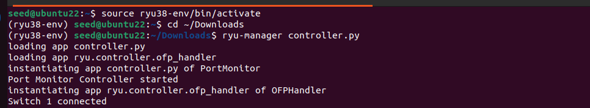
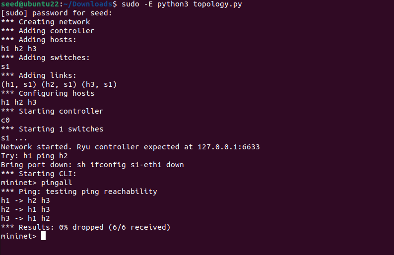
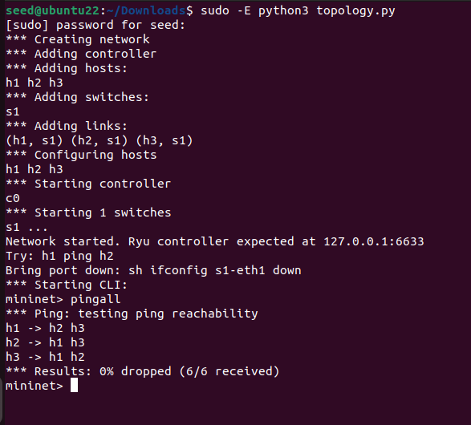
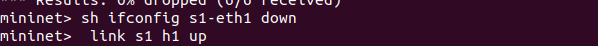
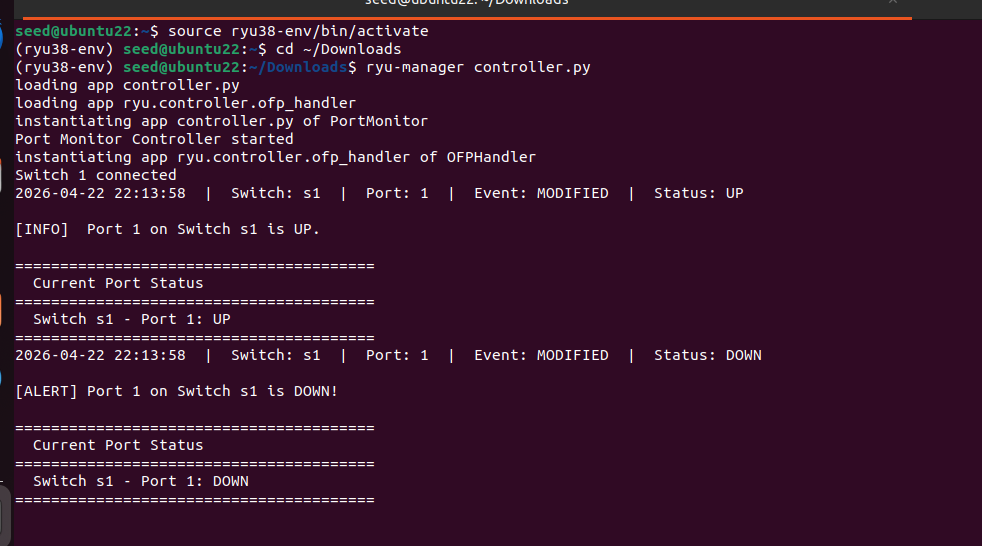
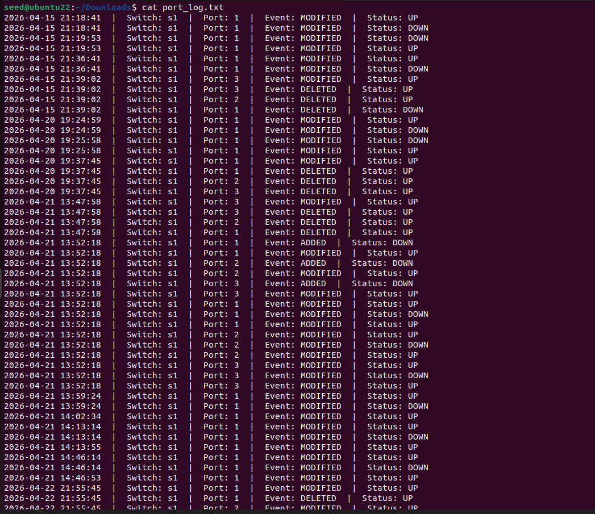
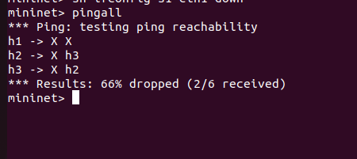
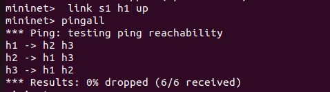

# Mininet Port Monitor — SDN Lab with Ryu Controller

A simple Software-Defined Networking (SDN) lab that monitors switch port status events in real time using a Ryu OpenFlow controller and a Mininet network topology.

---

## Overview

This project sets up a virtual network with one switch (`s1`) and three hosts (`h1`, `h2`, `h3`). A custom Ryu controller listens for OpenFlow events and logs whenever a port goes up or down — printing alerts to the terminal and writing them to a log file (`port_log.txt`).

---

## Project Structure

```
.
├── controller.py      # Ryu SDN controller — monitors ports, learns MACs, logs events
├── topology.py        # Mininet topology — 1 switch, 3 hosts, remote controller
├── port_log.txt       # Auto-generated log of port events (created at runtime)
└── commands_mininet.txt  # Quick reference for commands
```

---

## Prerequisites

- [Mininet](http://mininet.org/download/)
- [Ryu SDN Framework](https://ryu.readthedocs.io/en/latest/getting_started.html)
- Python 3
- A virtual environment with Ryu installed (e.g. `ryu38-env`)

---

## Setup

Activate your Ryu virtual environment before running anything:

```bash
source ryu38-env/bin/activate
cd ~/Downloads
```

To clean up any previous Mininet state:

```bash
sudo mn -c
```

---

## Running the Lab

Open **two terminals** (both with the virtual environment activated).

### Terminal 1 — Start the Ryu Controller

```bash
ryu-manager controller.py
```

The controller will start listening on port `6633` for switch connections.
>

### Terminal 2 — Start the Mininet Topology

```bash
sudo -E python3 topology.py
```

This launches a network with:
- Switch `s1`
- Hosts `h1` (`10.0.0.1`), `h2` (`10.0.0.2`), `h3` (`10.0.0.3`)
- A remote controller at `127.0.0.1:6633`
>

---

## Mininet CLI Commands

Once the topology is running, use the Mininet CLI to interact with the network:

| Command | Description |
|---|---|
| `pingall` | Test connectivity between all hosts |
>

| `sh ifconfig s1-eth1 down` | Bring port 1 on switch s1 down |

| `link s1 h1 up` | Bring the link between s1 and h1 back up |

>
---

## How It Works

### Controller (`controller.py`)

The `PortMonitor` Ryu app does three things:

**1. Default flow rule installation**
When a switch connects, it installs a table-miss flow rule that sends all unmatched packets to the controller.

**2. MAC learning & packet forwarding**
On each `PacketIn` event, the controller learns which port a source MAC address came from. If the destination MAC is known, it installs a targeted flow rule; otherwise it floods.

**3. Port status monitoring**
The `port_status_handler` listens for `OFPPortStatus` events (port added, deleted, or modified) and logs:
- The switch ID and port number
- Whether the event was ADD / DELETE / MODIFY
- Whether the port is currently UP or DOWN
>

Events are printed to the console and appended to `port_log.txt` with timestamps.

### Topology (`topology.py`)

Defines a simple star topology:

```
h1 ──┐
h2 ──┤── s1 ──── [Ryu Controller @ 127.0.0.1:6633]
h3 ──┘
```

Uses `TCLink` for traffic control and auto-assigns MAC addresses.

---

## Log File

Port events are recorded in `port_log.txt` in the format:

```
2025-01-01 12:00:00  |  Switch: s1  |  Port: 1  |  Event: MODIFIED  |  Status: DOWN
```
>
---

## Example Output

When you bring a port down with `sh ifconfig s1-eth1 down`, you should see in Terminal 1:

```
[ALERT] Port 1 on Switch s1 is DOWN!

========================================
  Current Port Status
========================================
  Switch s1 - Port 1: DOWN
========================================
```
>
>